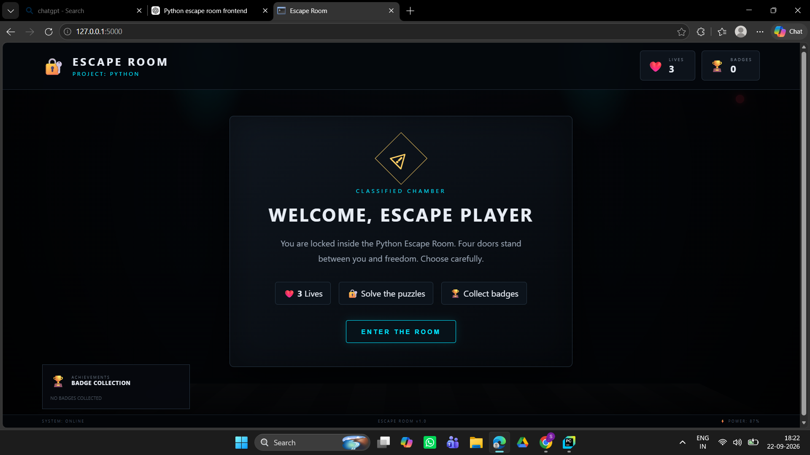
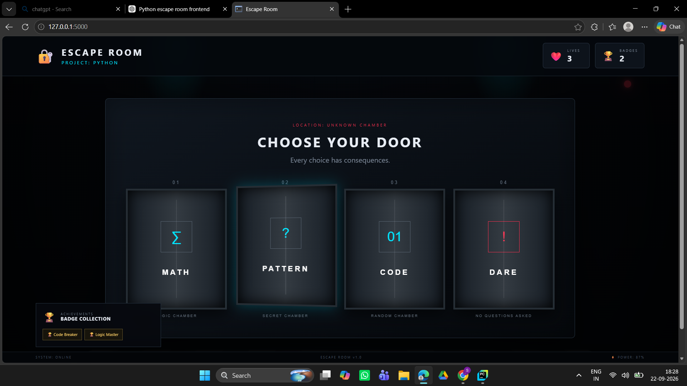
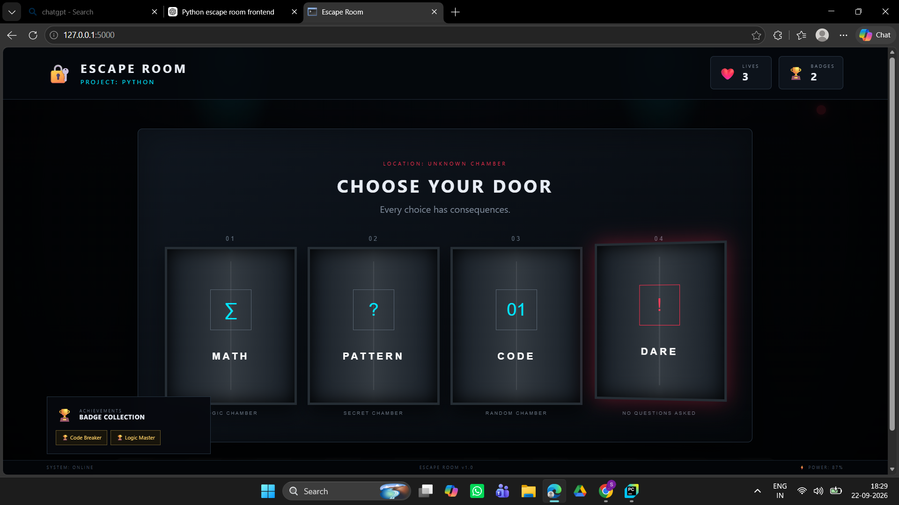
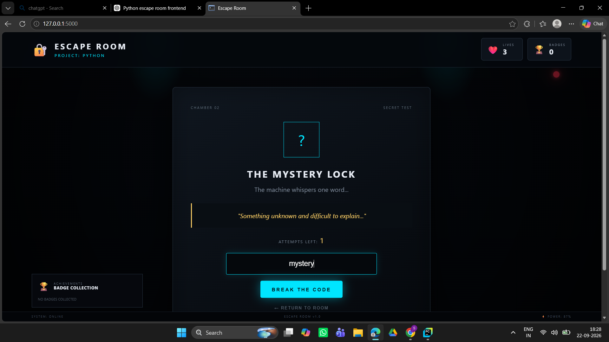
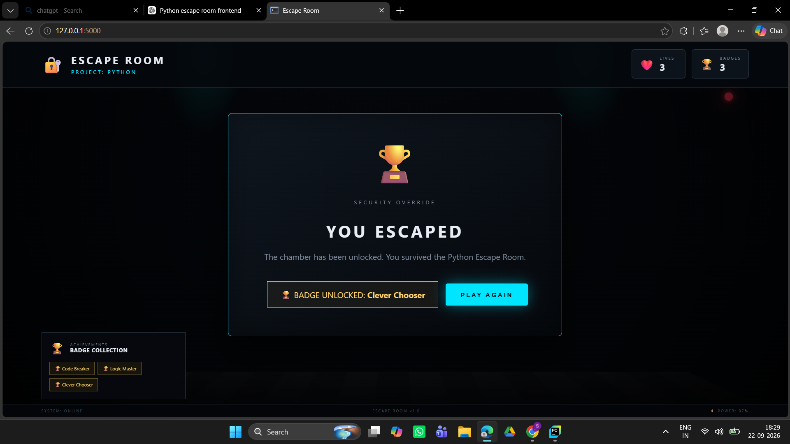

# 🎮 Python Escape Room Game

> 🔐 **Choose a door. Solve the challenge. Don't lose your lives. Escape!**

A fun interactive **Escape Room Game** built with Python and transformed into a web-based gaming experience using **Flask, HTML, CSS, and JavaScript**.

This project started as a simple Python console game. I wanted to make it more interactive and enjoyable to play, so I created a **gaming-room style web interface** connected to the Python backend.

---

## 🎮 Game Preview

### 🏠 Welcome to the Escape Room


### 🚪 Choose Your Door




### 🧩 Solve the Challenge



### 🏆 Escape Successfully



---

## 🔐 What Can You Do?

🎯 **Choose from different doors**

* 🔢 **Math Door** — Solve a mathematical puzzle
* 🔎 **Pattern Door** — Find the secret word
* 🎲 **Code Door** — Guess the lucky number
* 🚪 **Dare Door** — Take the shortcut and escape

❤️ **You have 3 lives**

🏆 **Collect random badges**

🎮 **Explore an interactive gaming-room interface**

---

## ✨ Features

* ❤️ 3 Lives System
* 🔢 Math Challenge
* 🔎 Secret Word Challenge
* 🎲 Lucky Number Challenge
* 🚪 Dare Door
* 🏆 Random Reward Badges
* 🔄 Restart Game
* 🎮 Interactive gaming-style interface
* 🔗 Frontend and Python backend communication
* 📱 Responsive design

---

## 🛠️ Technologies Used

| Technology | Purpose              |
| ---------- | -------------------- |
| 🐍 Python  | Game logic & backend |
| 🌐 Flask   | Web framework        |
| HTML       | Page structure       |
| CSS        | Gaming-room design   |
| JavaScript | User interaction     |
| Jinja2     | Flask templates      |

---

## 📁 Project Structure

```text
Escape_Room/
│
├── app.py
├── README.md
├── requirements.txt
├── .gitignore
│
├── templates/
│   └── index.html
│
├── static/
│   ├── style.css
│   └── script.js
│
└── screenshots/
    ├── welcome.png
    ├── doors.png
    ├── puzzle.png
    └── success.png
```

---

## 🚀 How to Run

### 1. Clone the repository

Clone this repository using Git:

```bash
git clone https://github.com/shabanashaik1061-source/python-escape-room.git
```

Then navigate to the project folder:

```bash
cd python-escape-room
```

### 2. Open the project

Open the downloaded folder in **PyCharm**.

### 3. Create a virtual environment

```bash
python -m venv .venv
```

### 4. Activate the environment

For Windows:

```bash
.venv\Scripts\activate
```

### 5. Install dependencies

```bash
pip install -r requirements.txt
```

### 6. Run the game

```bash
python app.py
```

### 7. Open it in your browser

```text
http://127.0.0.1:5000
```

---

## 🎯 Why I Built This

This was mainly a **fun learning project**.

I started with a simple Python game and wanted to see if I could turn it into something that feels more like an actual game.

While building it, I practiced:

* Python programming
* Flask backend development
* HTML/CSS frontend design
* JavaScript interaction
* Connecting frontend and backend
* Debugging
* Building a complete small web application

---

## 🔮 Future Improvements

Some ideas I may add in the future:

* 🔊 Sound effects
* 🎵 Background music
* 🚪 More rooms
* 🧩 More puzzles
* ⚡ Different difficulty levels
* 🏆 Leaderboard
* 🎬 More animations
* 📱 Better mobile experience

---

## 👩‍💻 Author

### Shaik Shabana

**B.Tech CSE | Minor in Business Administration**

Built with Python, curiosity, and a little bit of fun. 😄

---

⭐ **If you enjoyed the project, consider giving the repository a star!**

💡 **Have fun escaping! 🔐🎮**
